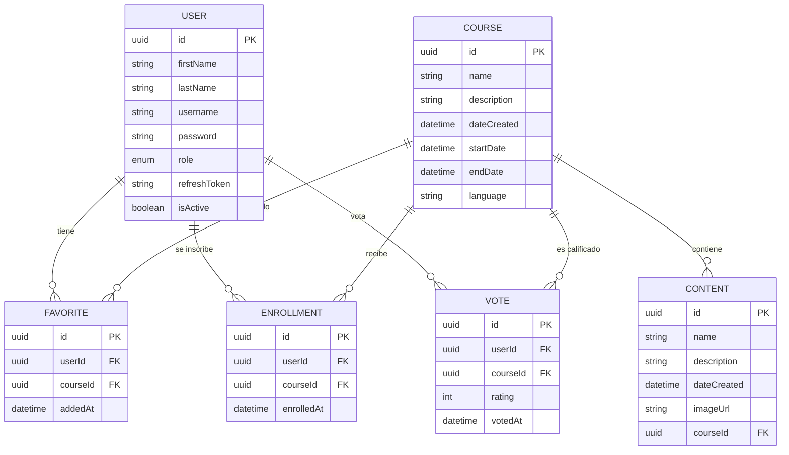

# Modelo de Datos - Urbano Admin

Este documento describe la estructura de la base de datos y las relaciones entre las entidades del proyecto.

## Diagrama Entidad-Relación (ERD)

## Descripción de Entidades

### User (Usuario)
Almacena la información de los usuarios del sistema, incluyendo sus credenciales y roles.
- **Roles**: `admin`, `editor`, `user`.
- **Estado**: `isActive` permite deshabilitar cuentas sin borrarlas.
- **Seguridad**: `password` está excluido de las respuestas de la API; `refreshToken` gestiona las sesiones.

### Course (Curso)
Representa los cursos disponibles en la plataforma.
- **Vigencia**: `startDate` y `endDate` permiten gestionar la disponibilidad temporal (usado en el Calendario).
- **Internacionalización**: Campo `language` (`es`/`en`) para segmentar contenidos.

### Content (Contenido)
Lecciones o módulos que pertenecen a un curso específico.
- **Cascada**: Si se elimina un curso, sus contenidos se eliminan automáticamente (`onDelete: 'CASCADE'`).
- **Multimedia**: `imageUrl` almacena la ruta de la imagen cargada (integrado con el servicio de carga de archivos).

### Enrollment (Inscripción)
Gestiona la relación muchos-a-muchos entre usuarios y cursos para el proceso de inscripción.
- **Auditoría**: `enrolledAt` registra el momento de la inscripción.

### Favorite (Favorito)
Permite a los usuarios marcar cursos para acceso rápido.
- **Cascada**: Se limpia automáticamente si el usuario o el curso desaparecen.

### Vote (Ranking)
Sistema de calificación de cursos por estrellas.
- **Valor**: `rating` almacena la puntuación numérica otorgada por el usuario.
